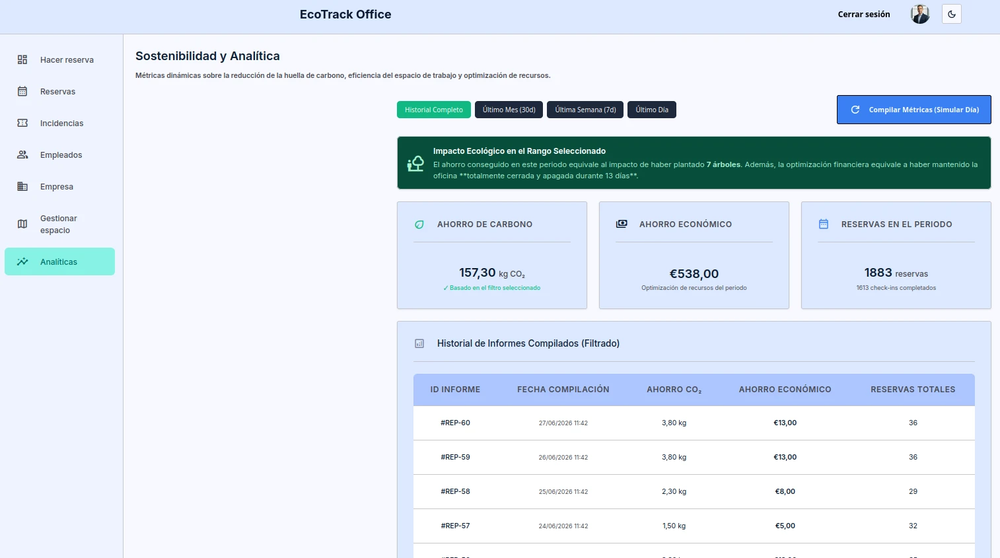

<h1 align="center">EcoTrack Office</h1>

<p align="center">
	Plataforma web para la gestion inteligente de oficinas hibridas
</p>

<p align="center">
	
	
	
	
	
	
</p>

<p align="center">
	
</p>

---

## Descripcion

EcoTrack Office es un Trabajo Final de Master centrado en optimizar el uso de espacios de trabajo, reducir ineficiencias operativas y aportar visibilidad sobre ahorro energetico y huella de CO2.

## Funcionalidades principales

- Autenticacion y autorizacion con JWT y control de acceso por roles.
- Gestion de usuarios, plantas, salas y escritorios.
- Reserva de escritorios y salas de reuniones.
- Mapa interactivo para consulta del estado de ocupacion.
- Gestion de incidencias y flujo de resolucion tecnica.
- Panel de analitica con metricas de ocupacion y sostenibilidad.

## Stack tecnologico

- Frontend: Angular
- Backend: Spring Boot (Java)
- Base de datos: MySQL
- Migraciones: Flyway
- Seguridad: Spring Security + JWT
- Despliegue local: Docker Compose

## Requisitos previos

- Docker y Docker Compose instalados.
- (Opcional) Java 21 y Maven para ejecutar backend sin Docker.
- (Opcional) Node.js y npm para ejecutar frontend sin Docker.

## Configuracion de entorno

### Backend local

1. Copia el archivo de ejemplo:

```bash
cp back/ecotrack-office/.env.example back/ecotrack-office/.env
```

2. Edita `back/ecotrack-office/.env` con tus valores:

```dotenv
DB_USERNAME=yourUsername
DB_PASSWORD=yourPassword
DB_URL=jdbc:mysql://localhost:3306/ecotrack
SPRING_PROFILES_ACTIVE=dev
JWT_SECRET=yourSecretKey
```

### Docker Compose (raiz del repositorio)

1. Copia el archivo de ejemplo en la raiz:

```bash
cp .env.example .env
```

2. Edita `.env` (raiz) con tus valores. Minimo recomendado:

```dotenv
DB_NAME=ecotrack
DB_USERNAME=ecotrack_user
DB_PASSWORD=ecotrack_password
MYSQL_ROOT_PASSWORD=root_password
SPRING_PROFILES_ACTIVE=dev
JWT_SECRET=yourSecretKey
```

## Ejecucion con Docker

Desde la raiz del repositorio:

```bash
docker compose up -d --build
```

Parar servicios:

```bash
docker compose down
```

## Ejecucion local sin Docker

Backend:

```bash
cd back/ecotrack-office
mvn spring-boot:run
```

Frontend:

```bash
cd front/ecotrack-office
npm install
npm run start
```

## Documentacion

La documentacion academica y tecnica se entrega junto con la memoria del proyecto.

## Nota academica

Proyecto desarrollado en el marco del Master en Programacion y Desarrollo de aplicaciones.
