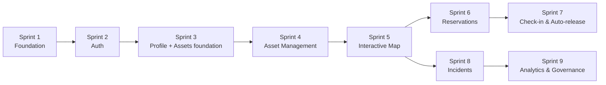

# EcoTrack Office — Sprint Calendar

**Project:** ecotrack_office  
**Total:** 5 epics · 23 stories · 9 sprints  
**Complexity key:** 🟢 Small · 🟡 Medium · 🔴 Large

> This calendar organizes stories into logical sprints based on technical dependencies.
> Fill in your own dates in the "Dates" column — no time estimates are imposed.
> Update `sprint-status.yaml` as you progress.

---

## Dependency Overview

---

## Sprint 1 — Foundation

**Goal:** The project runs locally end-to-end. Frontend and backend say hello to each other.

| Story | Title | Complexity | Depends on |
|-------|-------|------------|------------|
| 0.1 | Initialize Angular Frontend Workspace | 🟡 | — |
| 0.2 | Initialize Spring Boot Backend | 🟡 | — |
| 0.3 | Local Development Environment Setup | 🟢 | 0.1 + 0.2 |

**Sprint 1 Dates:** `______ → ______`

---

## Sprint 2 — Authentication

**Goal:** A user can register, log in, and be routed by role (EMPLOYEE / Organization Admin / TECHNICIAN).

| Story | Title | Complexity | Depends on |
|-------|-------|------------|------------|
| 1.1 | User Registration with GDPR Consent | 🟡 | Sprint 1 |
| 1.2 | User Login and Secure Session Management | 🟡 | 1.1 |

**Sprint 2 Dates:** `______ → ______`

---

## Sprint 3 — User Profile + Asset Foundation

**Goal:** Users manage their profile; admin can structure the organisation (floors, zones, users).

| Story | Title | Complexity | Depends on |
|-------|-------|------------|------------|
| 1.3 | Employee Profile & Saved Search Preferences | 🟢 | 1.2 |
| 1.4 | Organization Admin — User Administration | 🟡 | 1.2 |
| 2.1 | Floor & Zone Management | 🟡 | Sprint 1 |

**Sprint 3 Dates:** `______ → ______`

---

## Sprint 4 — Asset Management

**Goal:** Admin can configure all physical resources and upload the floor plan SVG with anchor positions.

| Story | Title | Complexity | Depends on |
|-------|-------|------------|------------|
| 2.2 | Desk & Meeting Room Management | 🟡 | 2.1 |
| 2.3 | SVG Floor Plan Upload & Anchor Association | 🔴 | 2.2 |

**Sprint 4 Dates:** `______ → ______`

---

## Sprint 5 — Interactive Floor Map

**Goal:** Employees see the live floor map with colour-coded desk availability and zone filters.

| Story | Title | Complexity | Depends on |
|-------|-------|------------|------------|
| 2.4 | Interactive Floor Map Viewer | 🔴 | 2.3 |
| 2.5 | Zone Heat Overlay, Map Filters & List View | 🔴 | 2.4 |

> ⚠️ **Critical sprint** — `FloorMapComponent` and `DeskMarkerComponent` built here. Sprints 6 and 8 are blocked until 2.4 is done.

**Sprint 5 Dates:** `______ → ______`

---

## Sprint 6 — Reservations

**Goal:** Employees can book a desk from the map and manage their reservations.

| Story | Title | Complexity | Depends on |
|-------|-------|------------|------------|
| 3.1 | Desk/Room Reservation & Conflict Prevention | 🔴 | 2.4 |
| 3.2 | My Reservations & Cancellation | 🟡 | 3.1 |

**Sprint 6 Dates:** `______ → ______`

---

## Sprint 7 — Check-in & Auto-release

**Goal:** Full attendance cycle: QR check-in, email fallback, automatic release of ghost reservations.

| Story | Title | Complexity | Depends on |
|-------|-------|------------|------------|
| 3.3 | QR Code Generation & Desk Check-in | 🟡 | 3.1 |
| 3.4 | Email Link Check-in & Pre-release Reminder | 🟡 | 3.1 |
| 3.5 | Auto-release Scheduler | 🟡 | 3.3 + 3.4 |

**Sprint 7 Dates:** `______ → ______`

---

## Sprint 8 — Incidents

**Goal:** Employees report issues; technicians are notified and manage resolution lifecycle; admin has oversight.

| Story | Title | Complexity | Depends on |
|-------|-------|------------|------------|
| 4.1 | Incident Reporting & Automatic Resource Blocking | 🟡 | 2.4 |
| 4.2 | Real-time Technician Notification & Incident Lifecycle | 🟡 | 4.1 |
| 4.3 | Organization Admin — Incident Overview | 🟡 | 4.2 |

**Sprint 8 Dates:** `______ → ______`

---

## Sprint 9 — Analytics & Governance

**Goal:** Organization Admin has full occupancy visibility, consolidation suggestions, and GDPR-compliant data tools.

| Story | Title | Complexity | Depends on |
|-------|-------|------------|------------|
| 4.4 | Occupancy Dashboard | 🔴 | 3.1 + 4.3 |
| 4.5 | Zone Consolidation Suggestions & Targeted Notifications | 🔴 | 4.4 |
| 4.6 | Reporting, Data Export & GDPR Governance | 🟡 | 4.4 |

**Sprint 9 Dates:** `______ → ______`

---

## Summary Table

| Sprint | Goal | Stories | Complexity |
|--------|------|---------|------------|
| 1 | Foundation | 0.1, 0.2, 0.3 | 🟡🟡🟢 |
| 2 | Authentication | 1.1, 1.2 | 🟡🟡 |
| 3 | Profile + Assets foundation | 1.3, 1.4, 2.1 | 🟢🟡🟡 |
| 4 | Asset Management | 2.2, 2.3 | 🟡🔴 |
| 5 | Interactive Floor Map | 2.4, 2.5 | 🔴🔴 |
| 6 | Reservations | 3.1, 3.2 | 🔴🟡 |
| 7 | Check-in & Auto-release | 3.3, 3.4, 3.5 | 🟡🟡🟡 |
| 8 | Incidents | 4.1, 4.2, 4.3 | 🟡🟡🟡 |
| 9 | Analytics & Governance | 4.4, 4.5, 4.6 | 🔴🔴🟡 |

**🔴 Critical path:** Sprint 5 (Floor Map) blocks Sprints 6 and 8 — prioritise it.  
**💡 Tip:** Sprints 6–8 can run in parallel across students once Sprint 5 is done.
