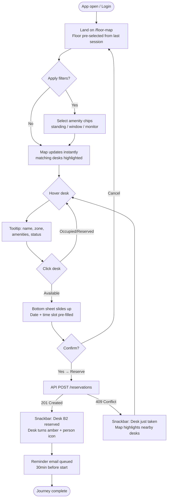
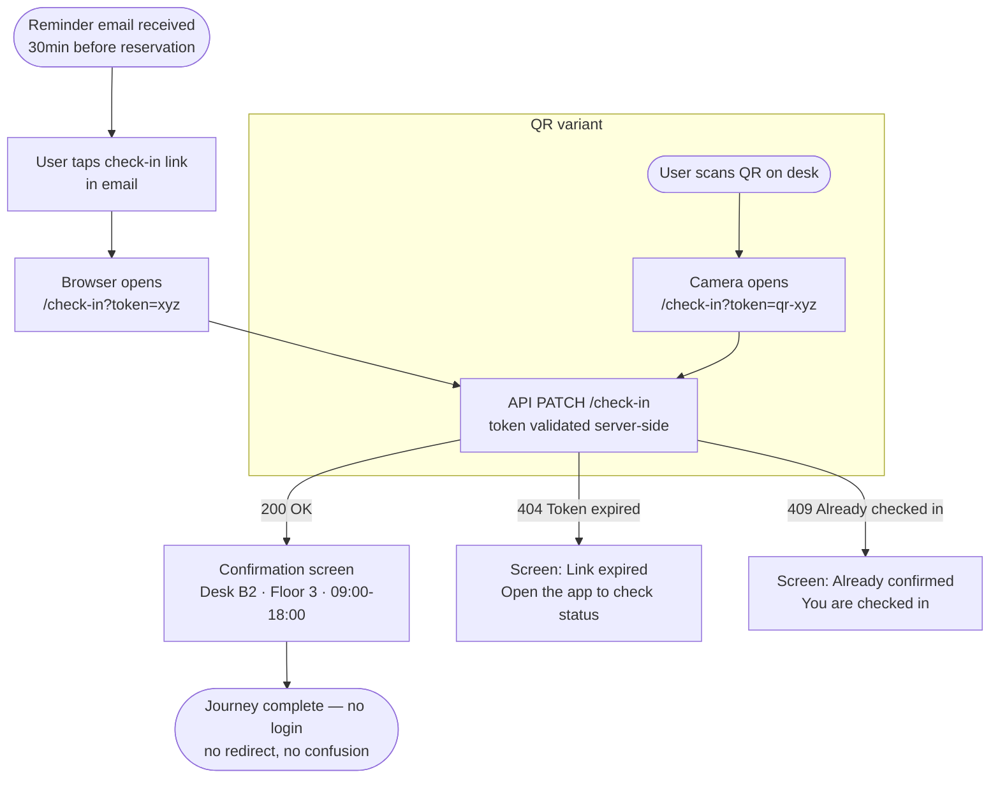
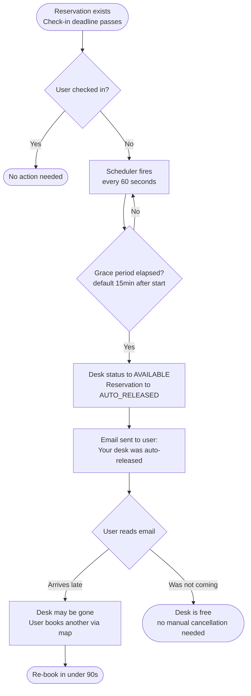
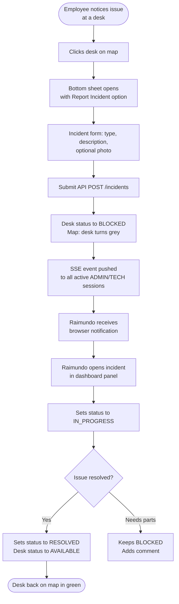
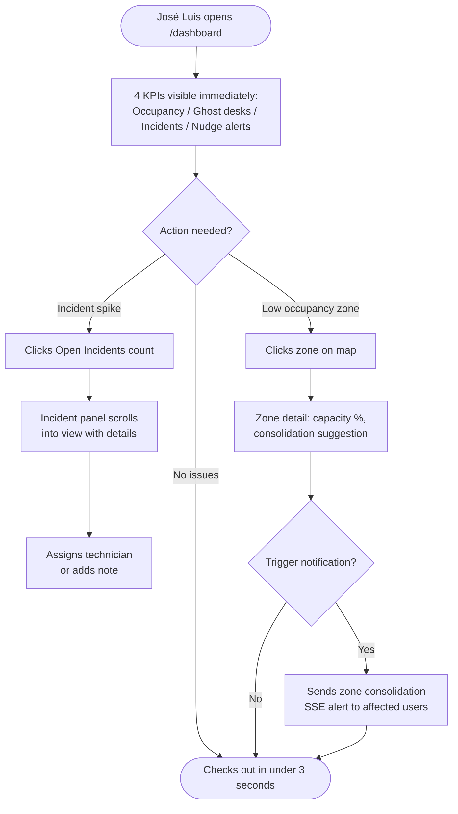

# UX Design Specification — EcoTrack Office

**Author:** Sensei
**Date:** 2026-04-20

---

<!-- UX design content will be appended sequentially through collaborative workflow steps -->

## Executive Summary

### Project Vision

EcoTrack Office is a smart workspace management platform for large hybrid-work office buildings. It resolves two simultaneous problems: employees cannot easily find available workspaces across multi-floor buildings, while facilities managers battle daily energy waste from ghost reservations and underused zones. The building floor plan is the primary interaction surface — not a list, not a calendar. Color-coded zone overlays nudge employees toward energy-efficient clustering, making the sustainable choice the obvious choice without mandating it. The system is designed for users who will not fully comply with procedures; non-compliance is made harmless through automation.

### Target Users

**Guillermo — The Flexible Employee (Primary, Happy Path)**
34-year-old R&D engineer working hybrid, 3 days/week, with precise workspace preferences (near restrooms, south-facing window). Books from his phone on the bus before arriving. Needs: fast criteria-based filtering, 2-tap booking, QR check-in on arrival. Success metric: desk found and reserved in ≤ 60 seconds.

**Eduardo — The Reluctant User (Primary, Edge Case)**
41-year-old sales rep, allergic to procedures, will not read any instructions. Books reluctantly, often misses check-in. Needs: a system that handles his non-compliance gracefully — auto-release, email-link check-in with zero session requirement, real-time map showing what's actually free. Success metric: no conflicts, no support requests, no learning required.

**Raimundo — The Concierge Technician (Operations)**
52-year-old maintenance technician, reactive by nature, currently informed by word of mouth. Needs: instant push notification on incident with location, photo, and one-tap status update. Success metric: notified in seconds, desk blocked automatically before he arrives.

**José Luis — The Facilities Manager (Admin)**
48-year-old head of general services, currently managing via spreadsheets nobody fills in. Needs: at-a-glance dashboard showing occupancy, incidents, and consolidation suggestions — without requiring employee compliance. Success metric: zero manual interventions for ghost desk recovery; weekly report in 2 clicks.

### Key Design Challenges

1. **Interactive SVG map on mobile** — The floor plan with desk markers, zone heat overlays, and filter interactions must be touch-friendly, legible on small screens, and load within 3 seconds. This is the primary interaction surface across all device sizes.
2. **Map-first interface for non-technical users** — Eduardo and José Luis will not tolerate a learning curve. The color-coded system and onboarding tooltip must be instantly self-explanatory. Zero documentation dependency.
3. **Zero-friction check-in** — The email link `/check-in?token=` must work without any app session, login, or app install. The confirmation screen must immediately reassure the user that their presence is confirmed.
4. **Admin dashboard at a glance** — José Luis needs occupancy, incidents, and consolidation suggestions readable in 3 seconds. No BI complexity; the data must speak for itself.
5. **Visual hierarchy on the map** — Desk status markers, zone heat overlay, active filters, and "data unavailable" banners must coexist without visual conflict or information overload.

### Design Opportunities

1. **Behavioral nudging through color** — The green/orange status system can make the energy-efficient clustering choice feel natural and slightly rewarding, like choosing the fastest checkout lane — without any coercion or explicit instruction.
2. **The floor map as the universal home screen** — Rather than a traditional navigation menu, the map becomes the hub from which everything flows: filtering, booking, checking in, reporting an incident. Every user type lands there first.
3. **The check-in email as a delight moment** — For Eduardo and reluctant users, a single email tap that instantly confirms their workspace — with no login, no redirect loop, no confusion — is a micro-interaction that can flip the perception of the tool from "annoying obligation" to "that was easy."

## Core User Experience

### Defining Experience

The defining experience of EcoTrack Office is **see → choose → book** directly on the floor map. In a single screen, a user sees which desks are free (green), occupied (red), and which zones are under-used via heat overlay. They click a desk, confirm in one click, and they are done. The entire booking flow — from app open to confirmed reservation — must be achievable in under 90 seconds with zero training, on a desktop browser, without reading any documentation.

### Platform Strategy

- **Primary platform**: Desktop web (Chrome/Firefox/Edge, 1280px+ screens) — users book from home or from their existing workstation
- **Secondary surface**: Mobile browser for QR check-in and email-link check-in only — no app install required, no responsive redesign needed beyond these two flows
- **Interaction model**: Mouse + keyboard primary; touch input supported only for the check-in confirmation screens
- **SVG map**: Zoomable/pannable with mouse wheel on desktop; pinch-to-zoom on mobile within the check-in confirmation view only
- **Offline**: No offline mode at MVP; graceful degradation with a "data unavailable" banner when polling fails — map still renders with last known state

### Effortless Interactions

1. **Desk discovery**: Hover a desk marker → tooltip instantly shows name, zone, amenities, status. No click needed to preview.
2. **Booking**: Click available desk → a bottom drawer appears pre-filled with today's date and the user's stored time-slot preference. One click to confirm.
3. **QR check-in**: User scans QR on desk → immediate green "✓ Checked in" screen. No session, no redirect, no spinner.
4. **Email check-in (fallback)**: One-tap from reminder email → same instant confirmation screen, stateless, no login wall.
5. **Auto-release**: Ghost desks are released without any user action. Users are notified by email if their desk is auto-released — they never have to proactively cancel.

### Critical Success Moments

1. **First booking in under 90 seconds** — If a new user books their first desk without any help, the product is validated.
2. **Check-in confirmation is instant and final** — A confusing redirect or unresolved spinner destroys trust in the system's reliability.
3. **The map reflects reality** — If a user sees "Available", arrives, and finds the desk occupied, the product fails. 30-second polling with a staleness banner is non-negotiable.
4. **Admin sees building state in 3 seconds** — José Luis opens the dashboard and understands occupancy, incidents, and consolidation alerts without any drill-down.
5. **Eduardo books without reading anything** — If a reluctant, procedure-averse user completes their first booking unaided, the UX has succeeded.

### Experience Principles

1. **The map IS the interface** — Every primary action (find, book, check-in, report incident) originates from or returns to the floor map. No alternative list-first navigation at MVP.
2. **Non-compliance is absorbed, not punished** — Auto-release, email check-in, and staleness banners handle human variability. The system does not require perfect user behavior.
3. **Desktop-first, mobile-capable for critical moments** — Design for 1280px screens; check-in flows are the only mobile-critical paths and must work flawlessly in a mobile browser.
4. **Confirmation is sacred** — Every state-changing action (booking, check-in, incident report) must produce an immediate, unambiguous success state.
5. **Green = go, orange = nudge, red = stop** — The color system must be globally consistent and self-explanatory without a legend. First-time users must guess correctly without instruction.

## Desired Emotional Response

### Primary Emotional Goals

- **Efficiency + Calm** — Finding and booking a desk should feel like taking the right corridor without hesitation. Not excitement, not frustration: just the quiet satisfaction of a task resolved in 30 seconds.
- **Trust in the data** — The map shows green → the user arrives → the desk is free. This repeated consistency builds implicit confidence in the system. Break it once, and everything collapses.
- **Lightness** (for Eduardo and reluctant users) — The tool must never feel like an administrative obligation. The target feeling is: "that was simpler than I expected."

### Emotional Journey Mapping

| Moment | Target Emotion | Emotion to Avoid |
|--------|---------------|-----------------|
| First access to the map | Curiosity, immediate clarity | Confusion — "what is this?" |
| Hovering over a free desk | Mild positive anticipation | Cold neutrality |
| Booking confirmation | Relief + micro-satisfaction | Doubt — "did it save?" |
| QR / email check-in | Micro-delight — "that's it?" | Redirect frustration |
| Auto-release email received | Understanding, no shame | Anger, feeling punished |
| Incident reported | Sense of having acted | Feeling ignored |
| Admin dashboard (José Luis) | Control, clarity | Cognitive overload, drowning in numbers |

### Micro-Emotions

- **Confidence > Skepticism** — critical: real-time data must be reliable; the "data unavailable" banner must appear honestly rather than displaying stale information
- **Accomplishment > Frustration** — every primary action ends in a clearly visible success state, without ambiguity
- **Mild surprise > Expected satisfaction** — the email check-in in one tap must positively surprise reluctant users
- **Control > Anxiety** — filters, map, statuses: users always know where they stand
- **Belonging > Isolation** — the map shows a living hive, not an empty building; green clustering zones reinforce the sense of community

### Design Implications

- **Trust** → fresh data every 30s, honest unavailability banner, confirmation with no unresolved spinner
- **Lightness** → zero superfluous required fields in booking, smart pre-fill, one-click confirm
- **Micro-delight at check-in** → subtle green animation on confirmation, human message ("You're confirmed — enjoy your day")
- **Admin control** → key metrics above the fold, no mandatory drill-down for the overview
- **No feeling of punishment** → auto-release email is factual and benevolent, never accusatory

### Emotional Design Principles

1. **Invisible reliability** — The system must inspire confidence without ever asking the user to think about it. Reliability is proven, not proclaimed.
2. **Reward the path of least resistance** — The quick, simple action leads to the best outcome. Never force users to work harder to "do things right."
3. **Failure is information, not accusation** — System events (auto-release, unavailability) are communicated factually, without blaming the user.
4. **Delight lives in the small moments** — The big wow is not the goal; it is the accumulation of micro-moments that do not create friction that builds lasting satisfaction.

## UX Pattern Analysis & Inspiration

### Inspiring Products Analysis

**Google Maps** *(map interaction + real-time state)*
The map IS the interface — information comes to the user, not the other way around. Key patterns: hover/tap a point of interest → an overlay card appears without leaving the map context; filter chips sit persistently above the map; real-time traffic overlay blends into the base layer without overwhelming it; "data unavailable" degrades gracefully to a cached state with a banner. The desk map mirrors this almost exactly: desk markers as points of interest, zone heat as the traffic layer, filter chips above the SVG.

**Booking.com** *(filtered search + frictionless confirmation)*
Progressive disclosure at its best: big picture first, details on demand. The booking confirmation is optimised to a single screen with smart defaults (today's date, standard times pre-filled). A persistent filter bar triggers instant results without page reload. Clear availability colour coding (green/orange/red) requires no legend. The one-click-to-confirm pattern is directly applicable to desk booking.

**Notion** *(dashboard clarity, calibrated information density)*
Clean visual hierarchy with key metrics above the fold, collapsible sections, and status badges (green/yellow/red) that communicate state at a glance. No chart for the sake of a chart. The admin dashboard for José Luis follows this same restraint — data speaks, decoration does not.

### Transferable UX Patterns

**Navigation Patterns**
- Map-as-hub (Google Maps) — no alternative list-first view needed at MVP; the map is the home screen for all user types
- Floating filter chips above the map (Google Maps) — amenity filters (standing desk, monitor, quiet zone) sit above the SVG as dismissible chips, not a sidebar drawer

**Interaction Patterns**
- Hover card preview (Google Maps) — hovering a desk marker shows a compact tooltip (name, zone, amenities, status) without leaving map context; click to expand to booking
- Bottom sheet with one-click confirm (Booking.com) — booking drawer pre-fills date and the user's stored time slot; single "Reserve" CTA
- Traffic-style zone heat overlay (Google Maps) — semi-transparent coloured zones over the SVG; green = well-used cluster, orange = consolidation nudge; togglable

**Visual Patterns**
- Availability colour coding without legend (Booking.com + Google Maps) — green/orange/red must be self-explanatory across all surfaces
- Status badge chips (Notion) — compact, coloured, label-only badges for desk status, incident severity, zone state
- Above-the-fold key metrics (Notion) — occupancy %, active incidents, consolidation alert count readable in 3 seconds before any scroll

### Anti-Patterns to Avoid

1. **List-only booking mode** (classic room booking tools) — forces users to mentally map room names to physical locations; breaks the "see it, book it" mental model
2. **Multi-step booking wizard** (Outlook Room Finder pattern: building → floor → room → time → confirm) — kills momentum; EcoTrack replaces all of this with a single map click
3. **Login-gated check-in** — requiring a session for check-in destroys the only positive interaction reluctant users have with the system
4. **Notification flooding** — over-notifying via SSE or email trains users to ignore all alerts; reserve push for critical state changes (auto-release, incident on your floor)
5. **Chart-heavy admin dashboards** (legacy FM tools) — 12 charts on one screen means José Luis looks at none of them; one clear number beats three confusing graphs

### Design Inspiration Strategy

**Adopt directly:**
- Google Maps hover card → desk tooltip on hover
- Booking.com pre-fill + one-click confirm → booking bottom sheet
- Google Maps traffic layer visual language → zone heat overlay
- Notion status badges → incident and desk status chips throughout the UI

**Adapt for EcoTrack's constraints:**
- Google Maps filter chips → simplify for amenity filters; fewer dimensions, persist selected filters in URL params for shareability
- Booking.com confirmation flow → reduce even further (no payment, no guest count, no extras)
- Notion metrics block → replace generic KPIs with EcoTrack-specific metrics (occupancy rate, ghost desk recovery rate, open incidents)

**Avoid entirely:**
- Any multi-step booking wizard pattern
- Any interaction requiring authentication for the check-in flow
- Dashboard designs with more than 3 primary KPIs visible simultaneously without scroll

## Design System Foundation

### Design System Choice

**Angular Material (Material Design Components — MDC/M3)**, the native Angular component library based on Material Design 3.

### Rationale for Selection

- **Native Angular integration** — zero adapter layer, fully tree-shakeable, plays perfectly with Angular 21 signals and standalone components
- **Accessibility built-in** — WAI-ARIA roles, focus management, keyboard navigation; critical for an internal enterprise tool used by all employee types
- **Design tokens via CSS custom properties** — Material 3's M3 token system allows full brand customisation without forking components; status colours (green/orange/red) integrate cleanly
- **Component coverage for EcoTrack's needs** — MatBottomSheet (booking drawer), MatSnackbar (check-in confirmation), MatChip (filter tags), MatSidenav (filter panel), MatDialog (incident report), MatTable (admin grids) — all available out of the box
- **Desktop-first density** — M3 comfortable density is appropriate for EcoTrack's desktop primary platform; no need to optimise for touch beyond check-in flows

### Implementation Approach

**Angular Material components used directly:**
- `MatBottomSheet` — booking confirmation drawer (one-click confirm)
- `MatChip` / `MatChipSet` — amenity filter tags above the SVG map
- `MatSnackBar` — transient feedback (auto-release notification, check-in success)
- `MatDialog` — incident report form, user preferences
- `MatSidenav` — collapsible filter/navigation panel (desktop)
- `MatTable` + `MatPaginator` — admin occupancy data grid, reservation list
- `MatDatepicker` — date selection in booking drawer
- `MatProgressBar` — occupancy percentage bars in dashboard widgets
- `MatCard` — desk detail hover card, dashboard metric cards

**Custom components (Angular CDK + raw Angular):**
1. `FloorMapComponent` — SVG viewer with mouse-wheel zoom and pan (Angular CDK DragDrop + custom HostListener)
2. `DeskMarkerComponent` — positioned overlay on SVG coordinates, status-coloured circle and tooltip trigger
3. `ZoneHeatOverlayComponent` — semi-transparent SVG `<rect>` layer driven by occupancy data
4. `CheckInConfirmationComponent` — standalone screen (no Material shell), mobile-friendly, used for both QR and email token flows
5. `OccupancyHeatmapWidget` — custom admin dashboard widget combining zone data with colour intensity

### Customisation Strategy

**M3 Design Token overrides (global `theme.scss`):**
- `--mdc-theme-primary`: EcoTrack brand colour (defined in visual design step)
- Custom semantic tokens: `--ecotrack-status-available: #4CAF50`, `--ecotrack-status-occupied: #F44336`, `--ecotrack-status-nudge: #FF9800`
- Typography scale: M3 defaults kept; body text slightly increased for desktop legibility
- Density: `$density: 0` (comfortable) across all components

**Component extension pattern:** Angular Material components are wrapped in thin `ecotrack-*` wrapper components that apply EcoTrack-specific defaults (e.g., `EcotrackButtonComponent` extends `MatButton` with brand colour preset) — avoids direct Material API coupling in feature components.

## 2. Core User Experience

### 2.1 Defining Experience

**"See a free desk on the floor map, click it, you're booked."**

This is EcoTrack Office's defining interaction. Unlike Tinder's swipe or Spotify's play, this is not novel — it is deliberately familiar. The value is in compressing what competitors turn into a 5-step wizard (choose building → choose floor → choose room → choose time → confirm) into a single spatial gesture. Users point at the space they want, as if pointing at a physical desk.

The secondary defining experience is: **"Tap the email link, you're checked in."** — the moment that wins reluctant users over.

### 2.2 User Mental Model

**How users currently solve this problem:**
- First-come-first-served: arrive early, claim a desk by putting their bag on it
- Informal messaging: "anyone using desk 4B today?"
- Spreadsheet sign-ups that nobody fills in reliably
- Accepting the uncertainty: just show up and hope

**Mental model users bring:**
- A desk is a physical object in a physical space — they think in *locations*, not in *IDs*
- Availability is binary: free or taken — no native concept of "reserved vs. present"
- Check-in is alien: they have never had to prove they are sitting at a desk before

**Where confusion is likely:**
- The difference between "reserved" (booked but not yet arrived) and "occupied" (QR checked in) — must be visually distinct states
- Auto-release: users may panic if their desk disappears — the notification email must be immediate and reassuring, never accusatory
- Zone heat overlay: new concept, must be learnable on first encounter without documentation

### 2.3 Success Criteria

| Criterion | Target |
|-----------|--------|
| Time from app open to confirmed booking | ≤ 90 seconds |
| First-time user completes booking without help | 100% success |
| Check-in completion rate via email link | ≥ 80% of recipients |
| User knows their booking is confirmed | Immediate visual feedback, zero ambiguity |
| Map reflects real occupancy | Data lag ≤ 30 seconds |
| Reluctant user books without reading documentation | Zero support requests in first week |

**What "this just works" means per persona:**
- Guillermo: filter to south-facing desks, click, confirm — done before his coffee gets cold
- Eduardo: no error messages, no required fields he does not understand, no login wall at check-in
- Raimundo: push notification arrives in seconds, desk status changes before he reaches it
- José Luis: opens dashboard, sees 3 numbers, knows immediately if today is a problem day

### 2.4 Novel vs. Established Patterns

**Established patterns adopted (users arrive knowing these):**
- Click-to-select on a map (Google Maps, Airbnb map view)
- Bottom sheet confirmation with pre-filled form (mobile booking apps)
- Email link for stateless authentication (magic links, common in consumer apps)
- Status colour coding green/red (universal, requires no explanation)

**Innovative combinations (familiar metaphors, new context):**
- **Heat overlay as behavioural nudge** — traffic layer metaphor applied to desk clustering for energy efficiency; users understand traffic maps, so orange "sparse zones" read intuitively as "avoid this area" without instruction
- **Auto-release as a feature, not a failure** — reframing "your desk was cancelled" as "we freed your desk automatically so you never need to cancel" changes the emotional register entirely

**No genuinely novel interactions** — intentional. EcoTrack's users range from tech-comfortable to tech-reluctant. Novel patterns require onboarding investment that conflicts with the zero-documentation principle.

### 2.5 Experience Mechanics

**The complete booking flow:**

**1. Initiation**
- User lands on `/floor-map` (default home screen after login)
- Map renders immediately with cached data; live data populates within 2 seconds
- Available desks are green; occupied desks are red; "reserved but unchecked" are amber

**2. Interaction**
- User optionally applies filter chips (amenity tags: standing desk, dual monitor, quiet zone, window seat)
- Map updates desk visibility instantly — Angular signal-based reactivity, no reload
- User hovers a green desk → hover card shows: desk name, zone, floor, amenities, availability window
- User clicks the desk → `MatBottomSheet` slides up: date (today pre-filled), time slot (user's last slot pre-filled), optional note field
- User clicks single "Reserve" CTA

**3. Feedback**
- Optimistic UI: desk turns amber immediately on click (before API response)
- On API 201 Created: `MatSnackBar` confirms "Desk 4B reserved for today 9:00–18:00"; desk marker updates to amber
- On conflict (409): snackbar shows "This desk was just taken — choose another" + nearby available desks highlighted
- On network error: snackbar shows "Could not save — try again"; desk reverts to green

**4. Completion**
- Bottom sheet auto-dismisses after confirmation
- User returns to map; their reserved desk shows a "yours" indicator (person icon)
- Reminder email queued for 30 minutes before reservation start, containing the one-tap check-in link

## Visual Design Foundation

### Color System

**Brand Palette**

| Token | Value | Usage |
|-------|-------|-------|
| `--ecotrack-primary` | `#00897B` (Teal 600) | Primary actions, nav active state, brand accent |
| `--ecotrack-primary-light` | `#4DB6AC` (Teal 300) | Hover states, focus rings |
| `--ecotrack-primary-dark` | `#005B4F` (Teal 800) | Active/pressed states |
| `--ecotrack-surface` | `#FAFAFA` | App background, card backgrounds |
| `--ecotrack-on-surface` | `#212121` | Primary text |
| `--ecotrack-on-surface-muted` | `#757575` | Secondary text, labels |
| `--ecotrack-outline` | `#E0E0E0` | Borders, dividers |

**Semantic Status Palette (map-wide and UI-wide)**

| Token | Value | Meaning |
|-------|-------|---------|
| `--ecotrack-status-available` | `#4CAF50` | Desk free, booking confirmed, check-in success |
| `--ecotrack-status-reserved` | `#FFA726` | Desk booked, awaiting check-in |
| `--ecotrack-status-occupied` | `#EF5350` | Desk occupied (checked in), blocked |
| `--ecotrack-status-nudge` | `#FF9800` | Zone heat overlay — consolidation suggestion |
| `--ecotrack-status-unavailable` | `#BDBDBD` | Desk out of service, incident blocked |

Dark mode: not in scope for MVP — single light theme.

WCAG compliance: all text/background pairs target AA (4.5:1 minimum). Status colours always paired with icon and text label when used outside the map — never colour-only communication on non-map surfaces.

### Typography System

Font family: **Roboto** (Angular Material default, no additional font request). No custom font pairing — reduces load time and maintenance overhead.

| Role | Size | Weight | Line height | Usage |
|------|------|--------|-------------|-------|
| Display | 32px | 400 | 40px | Page titles (floor name, dashboard header) |
| Headline | 24px | 500 | 32px | Section headers, dialog titles |
| Title | 20px | 500 | 28px | Card titles, form section labels |
| Body Large | 16px | 400 | 24px | Primary body copy, booking details |
| Body Medium | 14px | 400 | 20px | Secondary info, tooltips, table rows |
| Label | 12px | 500 | 16px | Chip labels, status badges, metadata |

Adjustment from M3 defaults: Body Large bumped from 14px to 16px for desktop legibility on high-DPI monitors.

### Spacing & Layout Foundation

Base unit: **8px**. All spacing values are multiples of 8px; 4px half-step permitted for fine-grained adjustments.

| Scale | Value | Usage |
|-------|-------|-------|
| `space-1` | 4px | Inline element gaps, icon-to-label |
| `space-2` | 8px | Form field internal padding, chip padding |
| `space-3` | 16px | Card padding, section internal margins |
| `space-4` | 24px | Card-to-card gaps, form row spacing |
| `space-5` | 32px | Section separators |
| `space-6` | 48px | Page section gaps |

**Layout structure (desktop 1280px+):**
- Topbar: fixed 64px — logo, user avatar, global nav
- Left sidebar: 280px collapsible — filter chips, floor/zone selector
- Main content: fills remaining viewport — floor map, detail panel slides in from right (320px)
- Map viewport: fills main content area with 16px padding all sides

Grid: no CSS grid on the map view — SVG coordinates are absolute; Angular CDK Overlay used for desk markers. Dashboard uses a 12-column Material grid with 24px gutters.

Elevation strategy (Material M3): Level 0 (surface), Level 1 (card), Level 2 (bottom sheet, sidenav), Level 3 (dialog). No Level 4+ — keeps the interface grounded and uncluttered.

### Accessibility Considerations

- **Colour-blind safety:** status colours always paired with icon (✓ / ⚠ / ✕) and text label on non-map surfaces; map includes a high-contrast mode toggle
- **Keyboard navigation:** all desk markers reachable via Tab; floor map has `role="application"` with arrow-key desk navigation
- **Focus indicators:** teal 2px outline, 2px offset on all interactive elements
- **Text contrast:** body text on surface = 9.7:1 (far above AA); muted text = 4.6:1 (AA compliant)
- **Reduced motion:** all animations (desk pulse, bottom sheet slide) respect `prefers-reduced-motion: reduce`

## Design Direction Decision

### Design Directions Explored

Five directions were generated and evaluated via interactive HTML showcase (`ux-design-directions.html`):

1. **Teal Map Hub** — teal topbar, left sidebar for floor/filter controls, status dots directly on SVG map
2. **Dark Sidebar** — white topbar, charcoal sidebar, enterprise SaaS feel, subbar filter chips
3. **Minimal + Booking Sheet** — tab navigation, full-width map, booking bottom sheet as centrepiece
4. **Admin Dashboard** — KPI bar above fold, map with prominent zone heat, right-side incident panel
5. **Check-in Screen** — standalone mobile screen for QR and email token flows (not a full layout direction)

### Chosen Direction

**Role-based dual layout:** Direction ① for employees, Direction ④ for facilities managers.

- **Employee default** (`/floor-map`): Teal Map Hub — teal 64px topbar, 280px collapsible left sidebar (floor selector + amenity filter chips + legend), full SVG map with desk dot markers and zone heat overlay, booking bottom sheet on desk click
- **Admin default** (`/dashboard`): Admin Dashboard — white 56px topbar with "Admin" badge, 4-KPI bar above fold, split view with map (zone heat prominent) and 300px right panel (incidents + consolidation suggestions)
- **Shared**: Check-in confirmation screen (Direction ⑤) used by both QR scan and email link flows — standalone, no shell, mobile-optimised

### Design Rationale

- **Teal Map Hub for employees**: the teal topbar delivers instant brand recognition; sidebar consolidates all controls without cluttering the map viewport; aligns with the "map IS the interface" principle and Guillermo/Eduardo personas
- **Admin Dashboard for José Luis**: 4 KPIs above the fold deliver the "building state in 3 seconds" success criterion; incident panel adjacent to map means no context switch between seeing a problem and understanding it; zone heat is more prominent as admins must act on it
- **Role-based routing**: Angular route guards redirect based on user role (`EMPLOYEE` → `/floor-map`, `ADMIN`/`TECHNICIAN` → `/dashboard`); shared components used across both layouts via composition

### Implementation Approach

- Shared `FloorMapComponent` embedded in both employee and admin views with different input configurations (employee: booking interactions enabled; admin: read-only with consolidation overlays)
- `AppShellComponent` with `@Input() mode: 'employee' | 'admin'` switches topbar style and sidebar content via structural directives
- Angular Router with role-based guards; deep-link to `/floor-map?floor=3` preserves map state across sessions via URL params
- Responsive breakpoints: sidebar collapses to icon-only at 1024px; admin KPI bar stacks vertically at 1024px; full mobile layout reserved for check-in screen only

## User Journey Flows

### Journey 1 — Employee Books a Desk (Guillermo)



### Journey 2 — Employee Checks In (Eduardo — email path)



### Journey 3 — Auto-release (Eduardo — non-compliant path)



### Journey 4 — Incident Report + Technician Response (Raimundo)



### Journey 5 — Admin Reviews Occupancy (José Luis)



### Journey Patterns

**Entry patterns:**
- All employee journeys start at `/floor-map` — no alternative entry needed
- Admin journeys start at `/dashboard`; the map is a secondary tool, not the home
- Check-in is always stateless — entered via external link, no session dependency

**Decision patterns:**
- Map click is the universal trigger — same gesture opens booking sheet (employee), incident detail, or zone detail (admin) depending on context and desk state
- All multi-state outcomes (conflict, error, already checked in) present the next best action, never a dead end

**Feedback patterns:**
- Optimistic UI on every write operation — visual change precedes API response
- Snackbar for transient success/error (auto-dismiss 4s)
- Full-screen confirmation only for check-in (high-stakes moment deserving full attention)
- Email as async feedback channel for auto-release and reminders — never for real-time actions

### Flow Optimization Principles

1. **Zero dead ends** — every error state presents the next best action (conflict → nearby desks highlighted; expired token → app link; already checked in → reassuring confirmation)
2. **Optimistic UI throughout** — desk state changes immediately on user action; rollback only if API fails
3. **Re-entry resilience** — all flows survive interruption; URL state preserved so users can return to exact context
4. **Async-first notifications** — reminders, auto-release, and incident alerts are email/SSE, never blocking modal interruptions during the booking flow
5. **Admin flows require zero employee cooperation** — every admin journey works regardless of whether employees comply with procedures

## Component Strategy

### Design System Components

Angular Material (MDC/M3) covers the following needs directly:

| Component | Usage in EcoTrack |
|-----------|------------------|
| `MatBottomSheet` | Booking confirmation drawer — slides up on desk click |
| `MatChip` / `MatChipSet` | Amenity filter tags, status badges throughout UI |
| `MatSnackBar` | Transient feedback: booking confirmed, conflict, auto-release |
| `MatDialog` | Incident report form, profile/preferences modal |
| `MatSidenav` / `MatSidenavContainer` | Collapsible left sidebar (floor selector + filter panel) |
| `MatTable` + `MatPaginator` | Reservation list, admin occupancy data grid |
| `MatDatepicker` | Date selection in booking drawer |
| `MatProgressBar` | Occupancy percentage bars in dashboard widgets |
| `MatCard` | Dashboard KPI cards, incident list cards |
| `MatToolbar` | App topbar (employee and admin variants) |
| `MatTooltip` | Simple hover fallback for non-SVG surfaces |
| `MatSelect` | Time slot selector in booking drawer |
| `MatButton` / `MatIconButton` | All CTAs and icon actions |
| `MatBadge` | Notification count on topbar icon |

### Custom Components

Five custom components with no Angular Material equivalent:

#### `FloorMapComponent`
**Purpose:** Renders and manages the interactive SVG floor plan with zoom, pan, and desk interaction.
**Usage:** Embedded in both employee (`/floor-map`) and admin (`/dashboard`) views with mode-based configuration.
**Anatomy:** SVG container + zoom/pan host + `DeskMarkerComponent` overlay layer + `ZoneHeatOverlayComponent` layer.
**States:** `loading` (skeleton shimmer), `ready` (interactive), `stale` (data unavailability banner), `error` (full error with retry CTA).
**Inputs:** `@Input() floorId: string`, `@Input() mode: 'employee' | 'admin'`, `@Input() filters: AmenityFilter[]`.
**Outputs:** `@Output() deskClicked: EventEmitter<Desk>`, `@Output() zoneClicked: EventEmitter<Zone>`.
**Accessibility:** `role="application"`, `aria-label="Floor plan — use arrow keys to navigate desks"`, desk markers expose full info via `aria-label`.

#### `DeskMarkerComponent`
**Purpose:** Represents a single desk as a positioned status dot on the floor map.
**Usage:** Created dynamically by `FloorMapComponent` for each desk in the current floor.
**Anatomy:** Coloured circle (status colour) + optional icon overlay (person for "mine", wrench for "blocked") + hover tooltip.
**States:** `available` (green with subtle pulse), `reserved` (amber, static), `occupied` (red, static), `mine` (teal, person icon), `blocked` (grey, wrench icon).
**Accessibility:** `role="button"`, `tabindex="0"`, `aria-label="Desk [name], [status]"`, `aria-pressed` for selected state.
**Reduced motion:** pulse animation disabled via `@media (prefers-reduced-motion: reduce)`.

#### `ZoneHeatOverlayComponent`
**Purpose:** Renders semi-transparent coloured zone rectangles over the SVG to indicate occupancy density.
**Usage:** Togglable layer above SVG base, below desk markers; visible by default in admin view.
**Anatomy:** SVG `<rect>` elements per zone + dashed border + zone label badge.
**States:** `hidden` (toggled off), `sparse` (orange overlay + warning label), `healthy` (light green overlay), `dense` (deeper green overlay).
**Inputs:** `@Input() zones: ZoneOccupancy[]`, `@Input() visible: boolean`.
**Accessibility:** Decorative — `aria-hidden="true"`; zone data accessible separately via zone click interaction.

#### `CheckInConfirmationComponent`
**Purpose:** Standalone full-viewport success screen for QR scan and email link check-in flows.
**Usage:** Route `/check-in?token=` — no app shell, no topbar, no navigation. Mobile-first layout.
**Anatomy:** Centred layout — status icon + headline + detail card (desk name, floor, date, time).
**States:** `loading` ("Confirming your check-in…"), `success` (green, confirmed details), `already-checked-in` (green, reassuring), `expired` (neutral, app link offered), `error` (red, retry option).
**Accessibility:** `role="main"`, `aria-live="polite"` on status region; no keyboard traps.

#### `OccupancyKpiCardComponent`
**Purpose:** Admin dashboard KPI card — single metric with label, value, and trend indicator.
**Usage:** 4 cards in the admin KPI bar (occupancy, ghost desks recovered, open incidents, nudge alerts).
**Anatomy:** Label (uppercase, muted) + large numeric value + sub-label (trend or contextual note).
**Variants:** `positive` (green value), `warning` (amber), `critical` (red), `neutral` (teal).
**Inputs:** `@Input() label: string`, `@Input() value: string | number`, `@Input() subLabel: string`, `@Input() variant: KpiVariant`.
**Accessibility:** `role="status"`, `aria-label="[label]: [value]"`.

### Component Implementation Strategy

- All custom components use the Angular standalone component API — no NgModule dependencies
- Design tokens consumed exclusively via CSS custom properties — no hardcoded colour values in component styles
- All `@Input()` properties are typed — no `any` types in component interfaces
- `FloorMapComponent` uses Angular CDK Overlay for desk marker positioning — pixel-perfect without absolute hacks
- All stateful components use Angular signals (`signal()`, `computed()`, `effect()`) for reactive updates
- Custom components follow the `ecotrack-*` selector prefix: `<ecotrack-floor-map>`, `<ecotrack-desk-marker>`, etc.

### Implementation Roadmap

**Phase 1 — Critical path (Epics 0–2):**
- `FloorMapComponent` — blocks all map-dependent stories
- `DeskMarkerComponent` — required for the map to be interactive
- `ZoneHeatOverlayComponent` — required for Story 2.5 (heat overlay + filters)

**Phase 2 — Booking + check-in (Epic 3):**
- `CheckInConfirmationComponent` — required for Stories 3.3 and 3.4
- `MatBottomSheet` booking integration — required for Story 3.1

**Phase 3 — Admin analytics (Epic 4):**
- `OccupancyKpiCardComponent` — required for Story 4.4 (admin dashboard)
- `MatTable` incident grid integration — required for Story 4.3

## UX Consistency Patterns

### Button Hierarchy

| Level | Component | Usage | Example |
|-------|-----------|-------|---------|
| Primary | `MatButton` filled, teal | One per view, highest-stakes CTA | "Reserve Desk", "Submit Incident" |
| Secondary | `MatButton` outlined, teal | Alternative action alongside primary | "Cancel", "Edit" |
| Tertiary | `MatButton` text, muted | Low-stakes or destructive actions | "Clear filters", "Delete account" |
| Icon-only | `MatIconButton` | Toolbar or map actions with tooltip | Floor pan, zoom in/out, toggle overlay |
| FAB | Not used at MVP | — | — |

**Rule:** Never more than one primary button per bottom sheet, dialog, or page section. The map view has no persistent primary button — action is triggered by clicking a desk.

### Feedback Patterns

| Situation | Pattern | Duration | Dismissible |
|-----------|---------|----------|-------------|
| Booking confirmed | `MatSnackBar` green, bottom-centre | 4s auto-dismiss | Yes |
| Conflict (409) | `MatSnackBar` amber + "choose another" | 6s, stays until dismissed | Yes |
| Network error | `MatSnackBar` red + "Try again" action | Persistent until dismissed | Yes |
| Auto-release received | `MatSnackBar` neutral + "Book again" action | Persistent | Yes |
| Check-in success | Full `CheckInConfirmationComponent` screen | Permanent (stays until user navigates) | No |
| Form validation error | Inline `MatError` below field | Until corrected | No |
| Map data stale | Banner at top of map area, non-blocking | Until data refreshes | No |

**Rule:** `MatSnackBar` for transient system feedback only. Never use snackbar for required user decisions — use `MatDialog` for those. Never stack more than one snackbar.

### Form Patterns

**Booking drawer form (minimal, 2 fields):**
- Date: `MatDatepicker` — defaults to today, restricts to future dates within the next 30 days
- Time slot: `MatSelect` with preset slots (Full day / Morning / Afternoon) — defaults to user's last used slot stored in `localStorage`
- Optional note: single-line `MatInput`, 140 char limit, placeholder "Any note for colleagues?"
- Validation: inline, on-submit only (not on-blur) — keeps the form feeling light, not interrogative

**Incident report form (in `MatDialog`):**
- Type: `MatSelect` — Broken equipment / Cleanliness / Safety / Other
- Description: `MatInput` textarea, required, 500 char limit
- Photo: optional file input, accepts image/*, max 5MB, preview thumbnail on selection
- Validation: on submit; required fields highlighted with `MatError`; no blocking pre-validation

**General form rules:**
- Labels always visible (no placeholder-as-label anti-pattern)
- Error messages use `MatError` — specific, not generic ("Select a time slot" not "Required field")
- No multi-page forms at MVP — all forms fit in a single dialog or bottom sheet

### Navigation Patterns

**Employee (Teal Map Hub):**
- Topbar: logo + 3 nav items (Floor Map active, My Reservations, Notifications bell with `MatBadge`)
- Active state: white pill background on topbar nav item
- No breadcrumb — single-level navigation
- Floor selector lives in sidebar, not in topbar — keeps topbar clean
- URL reflects floor: `/floor-map?floor=3` — browser back/forward works correctly

**Admin (Dashboard view):**
- Topbar: logo + "Admin View" badge + user avatar
- Primary navigation via topbar tabs (Dashboard, Assets, Users, Reports)
- No persistent sidebar — right panel is contextual (appears on map click)
- Breadcrumb only in deep admin pages (e.g., `/admin/assets/floors/3/desks/B2`)

**Cross-cutting:**
- No hamburger menu — desktop-first, always-visible navigation
- Active route highlighted — never relies on colour alone (also underlined or bolded)
- Keyboard shortcut `Escape` closes any open bottom sheet, dialog, or panel

### Modal and Overlay Patterns

| Overlay type | Trigger | Dismissible by | Use for |
|-------------|---------|---------------|---------|
| `MatBottomSheet` | Desk click | Escape, backdrop click, explicit close | Booking drawer |
| `MatDialog` | User action (Report, Preferences) | Escape, backdrop click (except confirm dialogs) | Forms, confirmations |
| Hover tooltip | Desk hover (mouse) | Mouse leave | Desk quick-preview |
| Right panel (admin) | Zone/incident click | Close button | Contextual admin detail |

**Rule:** Bottom sheet for actions initiated from the map (spatially anchored). Dialog for actions from topbar or buttons (context-independent). Never open a dialog from a bottom sheet — complete the action in the sheet itself.

### Empty States and Loading States

**Loading:**
- Floor map: skeleton shimmer on the entire SVG area while tiles load (max 2s)
- Data tables: `MatProgressBar` at top of table + skeleton rows (3 rows shown)
- KPI cards: pulse shimmer on value area

**Empty states (no data):**
- No reservations: illustration-free message + primary CTA ("Go to Floor Map to book your first desk")
- No incidents: green message ("No open incidents — all clear")
- No desks match filters: "No desks match your filters" + "Clear filters" tertiary button

**Error states:**
- Map fails to load: full error state with building icon, message, and "Retry" primary button
- API error on form submit: snackbar (non-blocking) + form remains open for retry

### Search and Filtering Patterns

**Floor map filters (amenity chips):**
- Always visible above SVG — `MatChipSet` with selectable chips
- Multi-select allowed — selected chips show teal background
- Filter state persisted in URL params (`?filters=standing,window`) — shareable links
- "X desks match" counter updates in real time as filters change
- "Clear all" link appears only when at least one filter is active

**Admin table filters:**
- Inline filter row above `MatTable` (status dropdown + date range)
- Filters apply immediately (no "Apply" button needed for simple filters)
- Active filters shown as removable chips above the table

## Responsive Design & Accessibility

### Responsive Strategy

EcoTrack Office is **desktop-first by design** — the primary workspace is a large interactive floor map that requires real estate to be useful. The responsive strategy applies three distinct modes:

| Mode | Context | Scope |
|------|---------|-------|
| **Desktop** (≥1024px) | Primary — employee booking + admin dashboard | Full feature set |
| **Tablet** (768–1023px) | Secondary — map browsing, read-only reservations | Degraded map, full booking |
| **Mobile** (< 768px) | Check-in only — `/check-in?token=` route | Single screen, no app shell |

**Principle:** No feature is hidden on desktop because of mobile constraints. The app is not "mobile-responsive" — it is "mobile-scoped": mobile devices access only the check-in flow.

### Breakpoint Strategy

Angular CDK BreakpointObserver drives all responsive behaviour:

```
xs  — 0–599px     → CheckInConfirmationComponent only; app shell hidden
sm  — 600–959px   → Tablet mode: sidebar collapses to icon rail, map pan/zoom touch-enabled
md  — 960–1279px  → Default desktop: sidebar visible, 12-col grid, full map
lg  — 1280px+     → Wide desktop: sidebar width expands to 320px, dashboard 3-col KPI bar
```

**Floor map:** below `md`, the SVG map switches to touch-scroll mode — no hover tooltips, desk tap opens a bottom sheet (same as mouse click). Amenity chip filters collapse to a horizontal scroll strip.

**Sidebar:** at `sm`, the `MatSidenav` collapses — a sticky `MatIconButton` at bottom-left reveals it on demand (no hamburger in topbar).

**Admin dashboard:** below `md`, KPI cards stack vertically (1-col), the contextual right panel becomes a full-width bottom sheet instead of an inline panel.

### Accessibility Strategy

Target: **WCAG 2.2 Level AA** — the EU Accessibility Act applies to workplace software in the target market.

| Category | Requirement | Implementation |
|----------|-------------|---------------|
| Colour contrast | 4.5:1 text, 3:1 UI components | Teal #00897B on white = 4.6:1 ✅ |
| Keyboard navigation | Full app navigable without mouse | `tabindex` on all interactive elements, `Escape` closes overlays |
| Focus indicators | Visible, not just colour-based | Angular Material 3 uses ring-style outline focus indicator |
| Screen reader | All interactive elements labelled | `aria-label` on desk markers, `role="application"` on map, `aria-live` on snackbar region |
| Touch targets | Minimum 44×44px | All `MatButton`, `MatIconButton`, desk markers meet target |
| Reduced motion | Animations optional | `@media (prefers-reduced-motion: reduce)` disables map pulse, skeleton shimmer, transitions |
| High contrast | System high contrast mode respected | CSS custom properties override to system colours when `forced-colors: active` |
| Alternative to colour | Status never conveyed by colour alone | Desk markers use colour + icon + `aria-label` text |

**Floor map specific:**
- `role="application"` on the map container signals a custom interaction model to screen readers
- Arrow key navigation between desks when map is focused (custom keyboard handler in `FloorMapComponent`)
- Screen reader users get a text-based desk list as an alternative view (toggle button above map)

### Testing Strategy

**Responsive testing:**
- Chrome DevTools device emulation across all 4 breakpoints during development
- Real device testing on: Android phone (check-in flow), iPad (tablet mode), 1080p desktop (primary)
- `ng test` with Angular CDK `BreakpointHarness` for breakpoint logic unit tests

**Accessibility testing:**
- **Automated:** `@angular-eslint` rules + `axe-core` integration via `@axe-core/angular` in development mode
- **Keyboard:** Full keyboard walk-through on each epic completion — floor map, booking drawer, incident form, admin dashboard
- **Screen reader:** VoiceOver on macOS for dev testing; NVDA on Windows for pre-release validation
- **Colour blindness:** Browser extension simulation (Deuteranopia, Protanopia) — all status colours verified to be distinguishable with icons

### Implementation Guidelines

**Responsive:**
- Use `rem` for font sizes, `%` and `vw/vh` for layout containers — never fixed `px` for layout
- Angular CDK `BreakpointObserver` injected into layout shell component — breakpoint state exposed as a signal
- SVG floor map: `viewBox` + `preserveAspectRatio="xMidYMid meet"` for intrinsic scaling; JavaScript zoom layered on top
- Images (floor plan assets): served as SVG; raster fallbacks not required at MVP

**Accessibility:**
- All Angular Material components used as-is — do not override their internal ARIA attributes
- Custom components must pass `a11y` review checklist before merge (checklist in `CONTRIBUTING.md`)
- `aria-live="polite"` region in app shell root for snackbar announcements
- Skip-nav link (`<a class="skip-link" href="#main-content">Skip to content</a>`) in `AppComponent` template
- Focus trap (`cdkTrapFocus`) applied to all `MatDialog` instances (built-in) and `MatBottomSheet` (built-in)
- Do not use `outline: none` without providing an equivalent custom focus indicator
