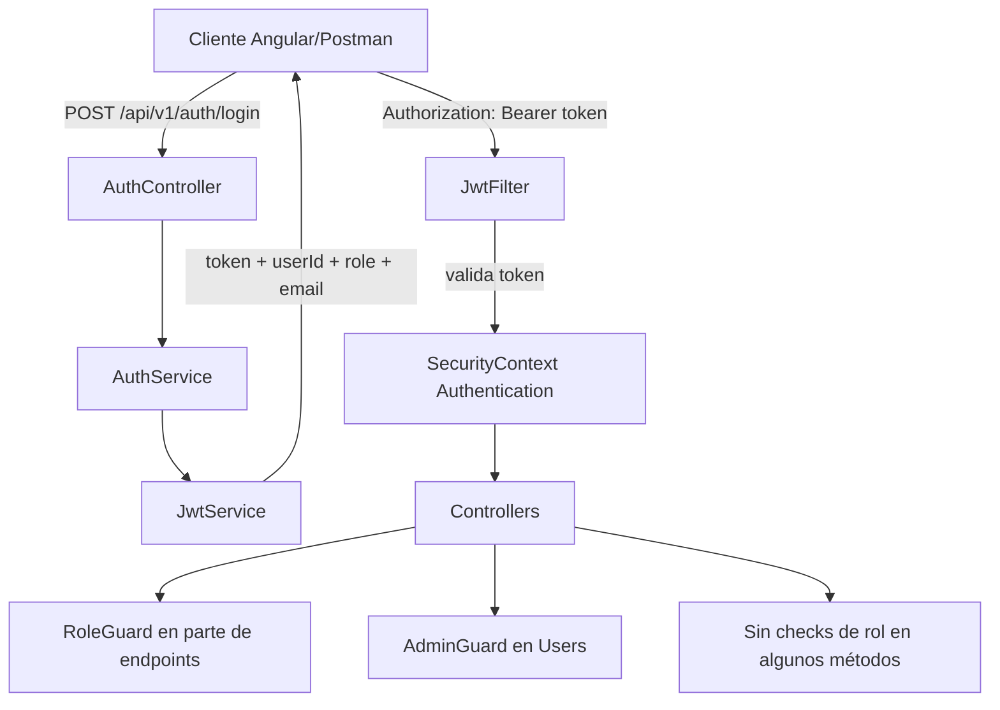

# Guía de Autenticación y Autorización (Estado Real)

## Alcance

Este documento describe el estado real de autenticación y autorización en el proyecto EcoTrack Office a fecha de junio de 2026.

Objetivo:
- reflejar lo que existe hoy en código;
- evitar ejemplos de una versión anterior de seguridad;
- dejar claros los gaps para completar la migración.

---

## 1. Resumen Ejecutivo

Estado general:
- Autenticación con JWT: implementada.
- Seguridad global Spring Security: implementada.
- Interceptor Angular para Bearer token: implementado.
- Autorización por rol en todos los controladores: no homogénea todavía.

Conclusión corta:
- La base de seguridad está correctamente montada.
- La capa de autorización por endpoint está parcialmente migrada y conviven patrones antiguos y nuevos.

---

## 2. Arquitectura Actual



---

## 3. Autenticación JWT (Backend)

### 3.1 Login

Endpoint público disponible:
- POST /api/v1/auth/login

Request:
```json
{
  "email": "technician@ecotrack.local",
  "password": "SecurePass123!"
}
```

Response esperada (según DTO actual):
```json
{
  "token": "eyJ...",
  "userId": 2,
  "role": "TECHNICIAN",
  "email": "technician@ecotrack.local"
}
```

Notas:
- No existe endpoint /api/v1/auth/register en el backend actual.
- No existen endpoints /api/v1/auth/logout ni /api/v1/auth/refresh en el backend actual.

### 3.2 Contenido del JWT

Claims usadas hoy:
- sub: userId
- role: rol del usuario
- iat: fecha de emisión
- exp: fecha de expiración

Expiración configurada:
- jwt.expiration = 86400000 (24h)

### 3.3 Filtro JWT

Flujo actual del filtro:
1. Lee header Authorization.
2. Si no existe o no empieza por Bearer, deja continuar.
3. Si existe Bearer, valida token.
4. Si es inválido, devuelve 401.
5. Si es válido, pone Authentication con:
   - principal = userId (Long)
   - authorities = ROLE_{role}

---

## 4. Seguridad Global (Spring Security)

Regla global actual:
- /api/v1/auth/**: permitAll
- /swagger-ui/** y /v3/api-docs/**: permitAll
- cualquier otra ruta: authenticated

Implicación:
- Todos los endpoints de negocio requieren autenticación JWT.
- Pero authenticated no significa automáticamente autorización fina por rol.

---

## 5. Autorización por Rol: Estado Real por Módulo

### 5.1 Patrón nuevo (RoleGuard)

Usado en varios controladores:
- FloorController: checks ADMIN para POST/PUT/DELETE.
- RoomController: check ADMIN en POST.
- DeskController: checks ADMIN en POST/PUT.
- ReservationController: check condicional en DELETE (ADMIN/TECH o propietario).

### 5.2 Patrón legacy activo (AdminGuard)

Sigue en uso en UserController para endpoints admin-only.

### 5.3 Endpoints sin control de rol explícito

Aunque están autenticados por SecurityConfig, no todos aplican filtros de rol en controller/service. Ejemplos visibles:
- varias operaciones en OrganizationController;
- varias operaciones en IncidentController;
- varias operaciones en AnalyticsController;
- algunas operaciones en RoomController y DeskController (PUT/DELETE según método).

---

## 6. Frontend Angular

Estado actual:
- auth.interceptor.ts añade Authorization: Bearer {token} si hay sesión.
- app.config.ts registra ese interceptor globalmente.
- auth.service.ts guarda token, userId, role y email en localStorage.

Gestión de errores:
- el interceptor trata 401: hace logout y redirige a /login.
- no hay manejo global específico para 403 (depende de cada pantalla/componente).

Enrutado:
- hay authGuard para algunas rutas;
- no todas las rutas privadas están protegidas con canActivate de forma uniforme.

---

## 7. Postman y Colecciones

La colección en docs incluye requests de una versión distinta de auth:
- /api/v1/auth/register
- /api/v1/auth/logout
- /api/v1/auth/refresh

Estos endpoints no existen en el backend actual.

Recomendación:
- actualizar la colección para conservar solo endpoints disponibles;
- añadir flujo estándar de login + reutilización de token Bearer para tests protegidos.

---

## 8. Coherencia del Sistema (Veredicto)

Sí es coherente en la base de seguridad:
- JWT funcional;
- filtro aplicado;
- estrategia stateless;
- interceptación frontend alineada.

No es totalmente coherente en autorización de negocio:
- migración incompleta a RoleGuard;
- mezcla RoleGuard/AdminGuard;
- diferencias entre controladores y métodos.

Por tanto:
- la descripción "sistema centralizado de roles extendido a TODOS los endpoints" no es exacta a día de hoy.

---

## 9. Plan de Alineación Recomendado

1. Unificar autorización en un único guard (RoleGuard) o en anotaciones coherentes.
2. Revisar endpoint por endpoint y definir matriz de acceso real (ADMIN/TECH/EMPLOYEE).
3. Aplicar checks explícitos en métodos que hoy dependen solo de authenticated.
4. Actualizar documentación con ejemplos exactamente trazables al código.
5. Limpiar colección Postman para eliminar endpoints no implementados.
6. Añadir tests de integración de autorización por rol.

---

## 10. Checklist de Mantenimiento del Documento

Cuando cambie auth/roles, validar siempre:
- que los ejemplos del documento existen literalmente en código;
- que la matriz de permisos coincide con controladores y servicios;
- que la colección Postman solo contiene endpoints reales;
- que frontend (guard/interceptor) refleja los códigos 401 y 403 esperados.

---

Documento actualizado: 21 de junio de 2026
Estado: reflejo de implementación actual (no de diseño objetivo)
