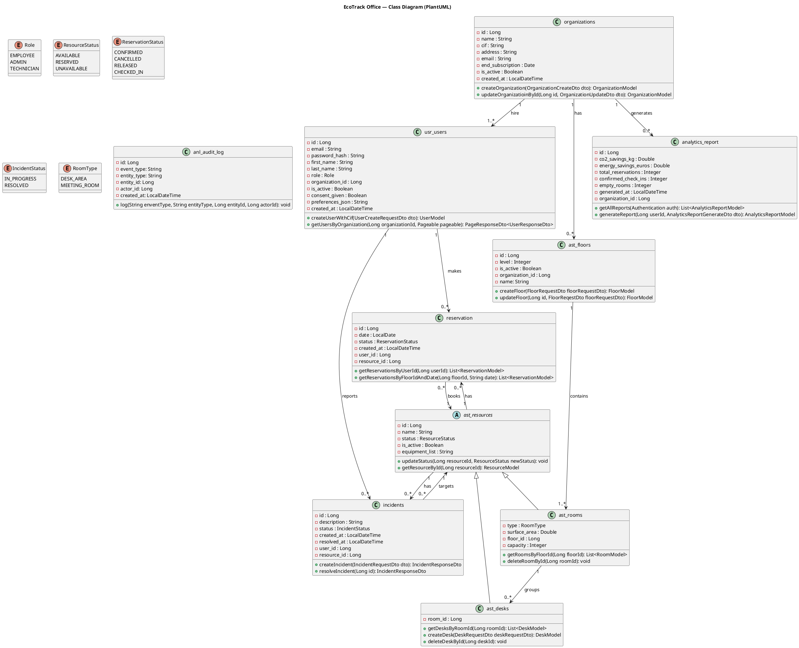

# EcoTrack Office — Class Diagram

_Generated from PRD and Architecture Decision Document._

```plantuml
@startuml
title EcoTrack Office — Class Diagram (PlantUML)

' Enumerations
enum Role {
    EMPLOYEE
    ADMIN
    TECHNICIAN
}
enum ResourceStatus {
    AVAILABLE
    RESERVED
    UNAVAILABLE
}
enum ReservationStatus {
    CONFIRMED
    CANCELLED
    RELEASED
    CHECKED_IN
}
enum IncidentStatus {
    IN_PROGRESS
    RESOLVED
}
enum RoomType {
    DESK_AREA
    MEETING_ROOM
}

' User & Organization (usr_)
class usr_users {
    - id : Long
    - email : String
    - password_hash : String
    - first_name : String
    - last_name : String
    - role : Role
    - organization_id : Long
    - is_active : Boolean
    - consent_given : Boolean
    - preferences_json : String
    - created_at : LocalDateTime
    + createUserWithCif(UserCreateRequestDto dto): UserModel
    + getUsersByOrganization(Long organizationId, Pageable pageable): PageResponseDto<UserResponseDto>
}

class organizations {
    - id : Long
    - name : String
    - cif : String
    - address : String
    - email : String
    - end_subscription : Date
    - is_active : Boolean
    - created_at : LocalDateTime
    + createOrganization(OrganizationCreateDto dto): OrganizationModel
    + updateOrganizatioinById(Long id, OrganizationUpdateDto dto): OrganizationModel
}

' Physical Assets (ast_)
class ast_floors {
    - id : Long
    - level : Integer
    - is_active : Boolean
    - organization_id : Long
    - name: String
    + createFloor(FloorRequestDto floorRequestDto): FloorModel
    + updateFloor(Long id, FloorReqestDto floorRequestDto): FloorModel
}

abstract class ast_resources {
    - id : Long
    - name : String
    - status : ResourceStatus
    - is_active : Boolean
    - equipment_list : String
    + updateStatus(Long resourceId, ResourceStatus newStatus): void
    + getResourceById(Long resourceId): ResourceModel
}

class ast_rooms {
    - type : RoomType
    - surface_area : Double
    - floor_id : Long
    - capacity : Integer
    + getRoomsByFloorId(Long floorId): List<RoomModel>
    + deleteRoomById(Long roomId): void
}

class ast_desks {
    - room_id : Long
    + getDesksByRoomId(Long roomId): List<DeskModel>
    + createDesk(DeskRequestDto deskRequestDto): DeskModel
    + deleteDeskById(Long deskId): void
}

' Reservation (rsv_)
class reservation {
    - id : Long
    - date : LocalDate
    - status : ReservationStatus
    - created_at : LocalDateTime
    - user_id : Long
    - resource_id : Long
    + getReservationsByUserId(Long userId): List<ReservationModel>
    + getReservationsByFloorIdAndDate(Long floorId, String date): List<ReservationModel>
}

' Analytic, Incident & AuditLog (anl_)
class incidents {
    - id : Long
    - description : String
    - status : IncidentStatus
    - created_at : LocalDateTime
    - resolved_at : LocalDateTime
    - user_id : Long
    - resource_id : Long
    + createIncident(IncidentRequestDto dto): IncidentResponseDto
    + resolveIncident(Long id): IncidentResponseDto
}

class analytics_report {
    - id : Long
    - co2_savings_kg : Double
    - energy_savings_euros : Double
    - total_reservations : Integer
    - confirmed_check_ins : Integer
    - empty_rooms : Integer
    - generated_at : LocalDateTime
    - organization_id : Long
    + getAllReports(Authentication auth): List<AnalyticsReportModel>
    + generateReport(Long userId, AnalyticsReportGenerateDto dto): AnalyticsReportModel
}

class anl_audit_log {
    - id: Long
    - event_type: String
    - entity_type: String
    - entity_id: Long
    - actor_id: Long
    - created_at: LocalDateTime
    + log(String enventType, String entityType, Long entityId, Long actorId): void
}

' Inheritance
ast_resources <|-- ast_desks
ast_resources <|-- ast_rooms

' Relationships
usr_users "1" --> "0..*" reservation : makes
usr_users "1" --> "0..*" incidents : reports
organizations "1" --> "0..*" ast_floors : has
organizations "1" --> "1..*" usr_users : hire
organizations "1" --> "0..*" analytics_report : generates

ast_floors "1" --> "1..*" ast_rooms : contains
ast_rooms "1" --> "0..*" ast_desks : groups
ast_resources "1" --> "0..*" reservation : has
ast_resources "1" --> "0..*" incidents : has

reservation "0..*" --> "1" ast_resources : books

incidents "0..*" --> "1" ast_resources : targets

@enduml
```
