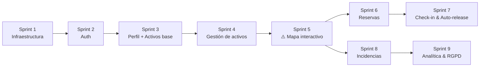

<!-- _class: cover -->

# 🌱 EcoTrack Office

### Plataforma de gestión inteligente de espacios de trabajo

---

Formación IDA — Proyecto final de módulo · Abril 2026

---

## ¿Qué es EcoTrack Office?

**Problema:** En los edificios de oficinas con trabajo híbrido, los espacios están mal utilizados: los empleados no saben qué hay disponible y los gestores luchan contra reservas fantasma y zonas encendidas sin nadie.

**Solución:** Una plataforma web que gestiona el espacio *y* el consumo energético al mismo tiempo.

| Para el empleado | Para el gestor de instalaciones |
|---|---|
| Mapa interactivo del edificio en tiempo real | Liberación automática de reservas abandonadas |
| Reserva en < 60 segundos | Dashboard de ocupación sin Excel |
| Check-in por QR o enlace de email | Sugerencias de consolidación de zonas |
| Vista de zonas activas (nudge energético verde) | Informes exportables + trazabilidad RGPD |

> **Diferenciador clave:** El plano del edificio *es* la interfaz de reserva. Las zonas con ocupación activa se resaltan para que la elección sostenible sea la elección obvia — sin obligar.

---

## Stack tecnológico

### Frontend

| Tecnología | Versión | Rol |
|---|---|---|
| **Angular** | 21 | SPA — módulo lazy-loaded por bloque |
| **Angular Material** | 18 | Biblioteca UI compartida |
| **RxJS** | 7.x | Estado reactivo (BehaviorSubject, polling 30s) |
| **TypeScript** | strict | Tipado fuerte en toda la app |

### Backend & Infraestructura

| Tecnología | Versión | Rol |
|---|---|---|
| **Spring Boot** | 3.5.x | API REST, seguridad JWT, scheduler |
| **MySQL** | 8.x | Base de datos relacional (esquema único, prefijos por bloque) |
| **Flyway** | — | Migraciones de BD versionadas y coordinadas |
| **Docker Compose** | — | Entorno de dev reproducible (MySQL + MailHog) |
| **SpringDoc OpenAPI** | 2.8.x | Spec Swagger — contrato frontend↔backend desde la Semana 1 |

---

## Decisiones arquitectónicas clave

```
Auth        → JWT en cookies HttpOnly + Secure + SameSite=Strict  (8h access + refresh en BD)
Errores     → RFC 7807 Problem Details  (GlobalExceptionHandler @ControllerAdvice)
Tiempo real → SSE via Spring SseEmitter  (no WebSocket en MVP)
API         → URI versioning  /api/v1/  + camelCase JSON + ISO 8601 fechas
Formularios → Reactive Forms Angular  (espeja validación servidor)
```

---

## Arborescence — Frontend (Angular)

```
frontend/src/app/
├── core/                   ← Singletons globales
│   ├── auth/               │   AuthService, AuthGuard, RoleGuard, JwtService
│   ├── interceptors/       │   AuthInterceptor, ErrorInterceptor
│   └── sse/                │   SseNotificationService
│
├── shared/                 ← Componentes y pipes reutilizables
│   ├── material.module.ts  │   Re-exports Angular Material
│   ├── loading-spinner/
│   ├── confirm-dialog/
│   └── error-banner/
│
├── users/          ← Bloque 1 (lazy-loaded)  auth, perfiles, admin usuarios
├── assets-mgmt/    ← Bloque 2 (lazy-loaded)  plantas, zonas, escritorios, mapa SVG
├── reservations/   ← Bloque 3 (lazy-loaded)  reservas, check-in, auto-release
└── analytics/      ← Bloque 4 (lazy-loaded)  incidencias, dashboard, RGPD
```

`environment.ts` → `apiUrl`, `sseUrl`, `pollInterval`  |  `ng lint` + `ng build` sin errores

---

## Arborescence — Backend (Spring Boot)

```
backend/src/main/java/com/ecotrack/
├── common/                 ← GlobalExceptionHandler, OpenApiConfig, JwtFilter
│
├── users/                  ← Bloque 1  (tablas: usr_*)
│   ├── controller/         │   AuthController, UserController
│   ├── service/
│   ├── repository/
│   ├── model/              │   @Entity JPA
│   └── dto/                │   DTOs de entrada/salida (nunca entidades directas)
│
├── assets/                 ← Bloque 2  (tablas: ast_*)
├── reservations/           ← Bloque 3  (tablas: rsv_*)
└── analytics/              ← Bloque 4  (tablas: anl_*)

backend/src/main/resources/
└── db/migration/
    ├── V1__init.sql        ← baseline vacío
    ├── V2__users.sql       ← Bloque 1
    ├── V3__assets.sql      ← Bloque 2
    └── V4__reservations.sql
```

---

## Convenciones de nomenclatura

### Base de datos — snake_case con prefijo de bloque

```sql
Tablas   : usr_users · ast_desks · ast_zones · rsv_reservations · anl_incidents
Columnas : user_id · created_at · is_active · auto_release_minutes
Índices  : idx_{tabla}_{columna}  →  idx_rsv_reservations_desk_id
```

### API REST — recursos en plural, kebab-case

```
GET    /api/v1/users
GET    /api/v1/floor-plans/{floorId}/desks
POST   /api/v1/reservations
PATCH  /api/v1/reservations/{id}/check-in
POST   /api/v1/incidents/{id}/resolve
```

### Java / TypeScript

```
Java Classes   : UserService · ReservationController · CheckInTokenEntity
Java Methods   : findByEmail() · releaseExpiredReservations()
TS Components  : FloorMapComponent · ReservationFormComponent
TS Services    : ReservationService · SseNotificationService
TS Files       : floor-map.component.ts · auth.interceptor.ts
TS Enums       : ReservationStatus.CONFIRMED · DeskStatus.AVAILABLE
```

---

## Reparto del trabajo — 4 bloques, 4 estudiantes

| Bloque | Dominio | Tablas BD | Módulo Angular |
|---|---|---|---|
| **Bloque 1** | Auth & Gestión de usuarios | `usr_*` | `users/` |
| **Bloque 2** | Activos & Mapa interactivo | `ast_*` | `assets-mgmt/` |
| **Bloque 3** | Reservas & Check-in | `rsv_*` | `reservations/` |
| **Bloque 4** | Incidencias & Analítica | `anl_*` | `analytics/` |

**Dependencias críticas entre bloques:**
- Todos dependen de Bloque 1 (`AuthInterceptor`, `JwtFilter`)
- Bloques 3 y 4 dependen de Bloque 2 (mapa → `FloorMapComponent`)
- Las migraciones Flyway se coordinan en orden: V2 → V3 → V4
- El spec OpenAPI se define en la **Semana 1** como contrato vinculante → permite desarrollo paralelo

---

## Planning — 9 sprints · 23 historias



> ⚠️ **Camino crítico:** El Sprint 5 (Mapa) desbloquea los Sprints 6 *y* 8 — prioridad máxima.
> 💡 Una vez terminado Sprint 5, los Sprints 6, 7 y 8 pueden ejecutarse en paralelo.

---

## Epic Backlog — visión global

| Epic | Descripción | Historias | Estado |
|---|---|---|---|
| **Epic 0** | Infraestructura & Scaffold | 0.1, 0.2, 0.3 | 🟡 En curso |
| **Epic 1** | Auth & Gestión de usuarios | 1.1, 1.2, 1.3, 1.4 | 🟡 En curso |
| **Epic 2** | Activos & Mapa interactivo | 2.1 → 2.5 | ⬜ Backlog |
| **Epic 3** | Reservas, Check-in & Auto-release | 3.1 → 3.5 | ⬜ Backlog |
| **Epic 4** | Incidencias, Analítica & RGPD | 4.1 → 4.6 | ⬜ Backlog |

**23 historias en total** · Complejidad: 🟢 Pequeña · 🟡 Media · 🔴 Grande

---

## Epic 0 — Infraestructura & Scaffold (Sprint 1)

**Objetivo:** El proyecto funciona localmente de extremo a extremo. Frontend y backend se comunican.

| Historia | Título | Complejidad | Estado |
|---|---|---|---|
| **0.1** | Inicializar workspace Angular | 🟡 Media | `ready-for-dev` |
| **0.2** | Inicializar backend Spring Boot | 🟡 Media | `ready-for-dev` |
| **0.3** | Entorno de desarrollo local | 🟢 Pequeña | `ready-for-dev` |

---

## Historia 0.1 — Workspace Angular

> Como desarrollador, quiero un workspace Angular 21 scaffoldeado con routing, SCSS, TypeScript strict y Angular Material para que todos los equipos puedan empezar desde una base común.

**Criterios de aceptación clave:**
- `ng new ecotrack-office-frontend --routing --style scss --strict` ✔
- Angular Material añadido con tema personalizado
- Módulos `core/` y `shared/` creados con stubs (`AuthService`, `AuthGuard`, `loading-spinner`…)
- Rutas lazy-loaded stub: `users/`, `assets-mgmt/`, `reservations/`, `analytics/`
- `environment.ts` con `apiUrl`, `sseUrl`, `pollInterval`
- `ng lint` + `ng build` sin errores

---

## Historia 0.2 — Backend Spring Boot

> Como desarrollador, quiero un proyecto Spring Boot 3.5.x Maven con todas las dependencias, la estructura de paquetes por bloque, Flyway y el GlobalExceptionHandler RFC 7807.

**Dependencias incluidas:**
`web` · `data-jpa` · `mysql` · `security` · `validation` · `mail` · `lombok` · `devtools`
+ `springdoc-openapi` v2.8.x · `jjwt` · `flyway-core`

**Criterios de aceptación clave:**
- Paquetes: `com.ecotrack.users` · `.assets` · `.reservations` · `.analytics` · `.common`
- `GlobalExceptionHandler` → `ProblemDetail` RFC 7807 (nunca `Map<String, Object>`)
- Swagger UI en `/swagger-ui.html` con esquema JWT Bearer
- Config 100% externalizada vía variables de entorno (cero valores hardcodeados)
- Migración Flyway `V1__init.sql` (baseline vacío) se ejecuta al arrancar
- `mvn test` pasa sin fallos

---

## Historia 0.3 — Entorno de desarrollo local

> Como desarrollador, quiero un Docker Compose que levante MySQL 8 y MailHog con un solo comando para tener un entorno idéntico al del resto del equipo.

**Criterios de aceptación clave:**

```bash
docker-compose up -d   # listo en < 30 segundos
```

- MySQL 8 en puerto **3306** con BD `ecotrack` inicializada
- MailHog en puerto **1025** (SMTP) + **8025** (web UI)
- Volúmenes nombrados para persistencia de datos
- Ficheros `.env.example` en raíz, `frontend/` y `backend/`
- `README.md` con secuencia completa: prereqs → clone → env → docker → `ng serve` → `mvn spring-boot:run`
- El servidor Angular proxifica las llamadas API sin errores CORS

---

## Epic 1, Sprint 2 — Autenticación (historias 1.1 y 1.2)

**Objetivo:** Un usuario puede registrarse, hacer login y ser redirigido según su rol (EMPLOYEE / ADMIN / TECHNICIAN).

| Historia | Título | Complejidad | Estado |
|---|---|---|---|
| **1.1** | Registro con consentimiento RGPD | 🟡 Media | `ready-for-dev` |
| **1.2** | Login y gestión de sesión segura | 🟡 Media | `backlog` |

---

## Historia 1.1 — Registro con consentimiento RGPD

> Como visitante, quiero registrarme con nombre, email y contraseña y dar mi consentimiento RGPD explícito para poder acceder a la plataforma.

**Flujo:**
1. Formulario Angular con validación inline (nombre, email, contraseña ≥ 8 chars, checkbox RGPD obligatorio)
2. `POST /api/v1/auth/register` → `201 Created` con perfil (sin contraseña)
3. Contraseña almacenada con **bcrypt** (factor ≥ 12) — nunca en texto plano
4. Tabla `usr_users` (Flyway `V2__users.sql`): `id, name, email, hashed_password, role, gdpr_consent, consent_at, is_active, created_at, search_preferences JSON`

**Errores gestionados:**
- Email ya existe → `409 Conflict` (Problem Detail)
- Validación fallida → `400 Bad Request` con errores por campo
- Sin checkbox RGPD → formulario bloqueado

---

## Historia 1.2 — Login y sesión segura

> Como usuario registrado, quiero hacer login con email y contraseña y permanecer autenticado hasta 8 horas.

**Flujo:**
1. `POST /api/v1/auth/login` → JWT access token (8h) + refresh token
2. Tokens en cookies **HttpOnly + Secure + SameSite=Strict** (protección XSS)
3. Refresh token persistido en BD `usr_refresh_tokens` (revocable, sobrevive reinicios)
4. `AuthService.currentUser$` expone rol desde claims JWT
5. `AuthGuard` → redirige a `/login` si no autenticado
6. `RoleGuard` → `403` si rol insuficiente
7. `POST /api/v1/auth/logout` → revoca refresh token + borra cookies (204 No Content)

**Errores:** Credenciales inválidas → `401` sin indicar qué campo falla · Cuenta desactivada → `403`

---

<!-- _class: cover -->

# ¿Preguntas?

### Próximos pasos
1. Definir fechas en el sprint-calendar
2. Implementar Epic 0 (Storys 0.1 → 0.3)
3. Definir spec OpenAPI en Semana 1 antes de arrancar los bloques en paralelo

---

**Repositorio:** `ecotrack-office/`  ·  **Rama principal:** `main`  ·  **Doc:** `_bmad-output/`
